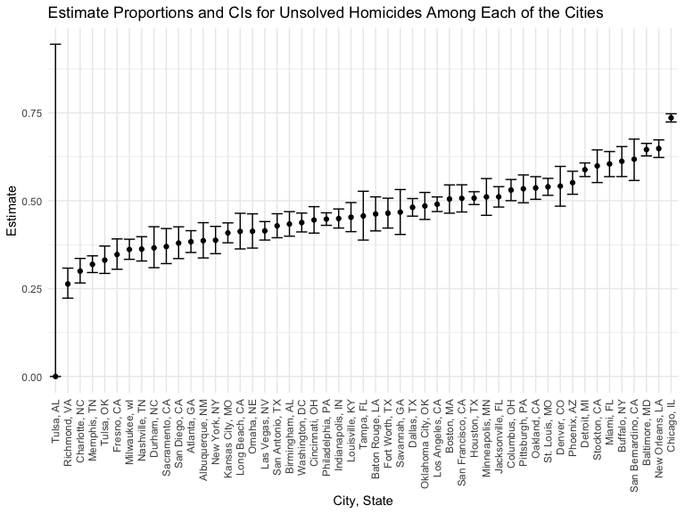

p8105_hw5_jc5924
================

## Problem 2

### Describe the data

``` r
homicides=read_csv("./data/homicide-data.csv")
```

    ## Rows: 52179 Columns: 12
    ## ── Column specification ────────────────────────────────────────────────────────
    ## Delimiter: ","
    ## chr (9): uid, victim_last, victim_first, victim_race, victim_age, victim_sex...
    ## dbl (3): reported_date, lat, lon
    ## 
    ## ℹ Use `spec()` to retrieve the full column specification for this data.
    ## ℹ Specify the column types or set `show_col_types = FALSE` to quiet this message.

- In this homicides datafrmame, we have 52179 of observations and 12 of
  variable that are uid, reported_date, victim_last, victim_first,
  victim_race, victim_age, victim_sex, city, state, lat, lon,
  disposition.

### Create a city_state variable and summarize the unsolved cases

``` r
homicides_summary=homicides %>% 
  janitor::clean_names() %>% 
  mutate(city_state=str_c(city,state,sep = ", "),
         status=case_when(disposition=="Closed by arrest"~"solved",
                          disposition=="Closed without arrest"~"unsolved",
                          disposition=="Open/No arrest"~"unsolved")) %>% 
  group_by(city_state) %>% 
  summarize(homicides_number=n(),
            unsolved=sum(status=="unsolved"))
homicides_summary
```

    ## # A tibble: 51 × 3
    ##    city_state      homicides_number unsolved
    ##    <chr>                      <int>    <int>
    ##  1 Albuquerque, NM              378      146
    ##  2 Atlanta, GA                  973      373
    ##  3 Baltimore, MD               2827     1825
    ##  4 Baton Rouge, LA              424      196
    ##  5 Birmingham, AL               800      347
    ##  6 Boston, MA                   614      310
    ##  7 Buffalo, NY                  521      319
    ##  8 Charlotte, NC                687      206
    ##  9 Chicago, IL                 5535     4073
    ## 10 Cincinnati, OH               694      309
    ## # … with 41 more rows

### Proportion of unsolved homicides

``` r
baltimore=prop.test(homicides_summary %>% filter(city_state=="Baltimore, MD") %>% 
                      pull(unsolved),
                    homicides_summary %>% filter(city_state=="Baltimore, MD") %>% 
                      pull(homicides_number)) %>% 
  broom::tidy() %>% 
  saveRDS(., "./data/baltimore_prop_test.rds")
```

### Prop.test for each of the cities

``` r
cities=homicides_summary %>% 
  mutate(prop_test=map2(.x=unsolved, .y=homicides_number, ~prop.test(x = .x, n = .y)),
         tidy=map(.x = prop_test, ~ broom::tidy(.x))) %>% 
  select(city_state,homicides_number,unsolved,tidy) %>% 
  unnest(tidy) %>% 
  select(city_state, estimate, conf.low, conf.high)
cities
```

    ## # A tibble: 51 × 4
    ##    city_state      estimate conf.low conf.high
    ##    <chr>              <dbl>    <dbl>     <dbl>
    ##  1 Albuquerque, NM    0.386    0.337     0.438
    ##  2 Atlanta, GA        0.383    0.353     0.415
    ##  3 Baltimore, MD      0.646    0.628     0.663
    ##  4 Baton Rouge, LA    0.462    0.414     0.511
    ##  5 Birmingham, AL     0.434    0.399     0.469
    ##  6 Boston, MA         0.505    0.465     0.545
    ##  7 Buffalo, NY        0.612    0.569     0.654
    ##  8 Charlotte, NC      0.300    0.266     0.336
    ##  9 Chicago, IL        0.736    0.724     0.747
    ## 10 Cincinnati, OH     0.445    0.408     0.483
    ## # … with 41 more rows

### Plot shows estimates and CIs

``` r
cities %>% 
  mutate(city_state=fct_reorder(city_state,estimate)) %>% 
  ggplot(aes(x=city_state,y=estimate))+
  geom_point()+
  geom_errorbar(aes(ymin=conf.low,ymax = conf.high))+
  labs(x = "City, State",
       y = "Estimate",
       title = "Estimate Proportions and CIs for Unsolved Homicides Among Each of the Cities")+
  theme(axis.text.x = element_text(angle = 90, vjust = 0.5, hjust = 1))
```


\## Problem 3 \### Setup simulation with n=30, σ=5, t-test

``` r
sim=function(n=30,mu=0,sigma=5){
     x=rnorm(n, mean=mu,sd = sigma)
     t_statistic=t.test(x,mu=0,conf.int = 0.95) %>% 
       broom::tidy()
     t_statistic
}
dataframe=vector("list", 5000)
for (i in 1:5000) {
  dataframe[[i]] = sim()
}
dataframe %>% 
  bind_rows()
```

    ## # A tibble: 5,000 × 8
    ##    estimate statistic p.value parameter conf.low conf.high method    alternative
    ##       <dbl>     <dbl>   <dbl>     <dbl>    <dbl>     <dbl> <chr>     <chr>      
    ##  1    0.497     0.706  0.486         29   -0.944     1.94  One Samp… two.sided  
    ##  2   -1.49     -1.73   0.0939        29   -3.25      0.269 One Samp… two.sided  
    ##  3    0.640     0.660  0.515         29   -1.34      2.62  One Samp… two.sided  
    ##  4    1.17      1.49   0.147         29   -0.439     2.79  One Samp… two.sided  
    ##  5    0.672     0.672  0.507         29   -1.37      2.72  One Samp… two.sided  
    ##  6   -0.631    -0.601  0.553         29   -2.78      1.52  One Samp… two.sided  
    ##  7    0.549     0.652  0.520         29   -1.17      2.27  One Samp… two.sided  
    ##  8   -1.30     -1.86   0.0732        29   -2.72      0.130 One Samp… two.sided  
    ##  9   -2.07     -2.42   0.0219        29   -3.81     -0.322 One Samp… two.sided  
    ## 10    0.249     0.250  0.804         29   -1.78      2.28  One Samp… two.sided  
    ## # … with 4,990 more rows

### Repeat it for true mean

``` r
sim_mean =
  tibble(true_mean = c(0:6)) %>% 
  mutate(
    output = map(.x = true_mean, ~rerun(5000, sim(mu = .x))),
    test= map(output, bind_rows)
    ) %>% 
  select(-output) %>% 
  unnest()
sim_mean
```

    ## # A tibble: 35,000 × 9
    ##    true_mean estimate statistic p.value parameter conf.low conf.high method     
    ##        <int>    <dbl>     <dbl>   <dbl>     <dbl>    <dbl>     <dbl> <chr>      
    ##  1         0   -0.865    -0.855 0.400          29   -2.94      1.20  One Sample…
    ##  2         0   -1.14     -1.18  0.248          29   -3.11      0.835 One Sample…
    ##  3         0    1.68      1.59  0.122          29   -0.474     3.83  One Sample…
    ##  4         0   -3.10     -3.37  0.00214        29   -4.98     -1.22  One Sample…
    ##  5         0   -1.54     -1.61  0.119          29   -3.49      0.418 One Sample…
    ##  6         0   -1.50     -1.51  0.141          29   -3.53      0.529 One Sample…
    ##  7         0   -0.199    -0.293 0.772          29   -1.59      1.19  One Sample…
    ##  8         0   -1.50     -1.35  0.189          29   -3.77      0.777 One Sample…
    ##  9         0   -0.542    -0.540 0.593          29   -2.59      1.51  One Sample…
    ## 10         0    1.11      1.07  0.294          29   -1.02      3.24  One Sample…
    ## # … with 34,990 more rows, and 1 more variable: alternative <chr>

### Plot of the power and the true mean

``` r
sim_mean %>% 
  group_by(true_mean) %>% 
  summarize(total = n(),
            rejected = sum(p.value < 0.05)) %>% 
  mutate(power=rejected/total) %>% 
  ggplot(aes(x =true_mean,y=power,color=true_mean)) +
  geom_point() +
  geom_smooth(se = FALSE) +
  labs(
    x = "True Mean ",
    y = "Power of the test",
    title = "Plot for Power of the Test over Means"
    )
```

    ## `geom_smooth()` using method = 'loess' and formula 'y ~ x'


